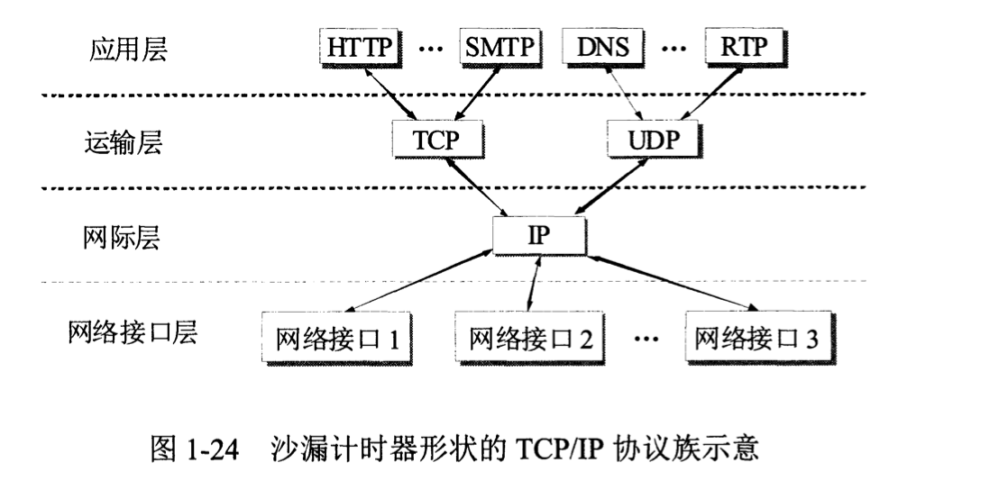

# 概述
## 互联网

* 互联网两个基本特点：连通性和资源共享
* 计算机网络：简称网络
  * 由若干结点和连接这些结点的链路组成
  * 网络中结点可以是计算机、交换机、路由器等
  * 有时候用云表示网络
* 网络通过路由器连接起来，构成**互连网**
* **互联网**：指用TCP/IP协议族作为通信规则的互连网
  * 组成：边缘部分、核心部分
  * 核心部分路由器之间用高速链路链接，边缘主机接入核心部分一般以速率链路连接
  * 边缘部分的主机：称为端系统
    * 主机A和B进行通信：主机A的某个进程和主机B某个进程通信
    * 端系统的通信方式
      * C/S方式：描述进程之间的服务和被服务的关系C是服务请求方，S是服务提供方
      * P2P方式：对等连接通信，本质仍然是C/S模式，每个主机既是客户端也是服务端
  * 核心部分
    * 核心部分：向网络边缘的主机供连通性，起核心作用的是路由器
      * 路由器：用于实现分组交换
      * 分组交换：采用存储转发技术
        * 发送的整块数据：报文
        * 将报文划分成小的数据段，每段加上控制信息组成的首部，构成一个分组
        * 分组称为包，分组首部称为包头
        * 路由器收到分组
          * 暂时存储一下，检查首部，查找转发表，然后找到合适的接口发出去
          * 这样一步一步把分组传递到目的主机
        * 讨论路由器转发分组的过程，将单个网络简化成一条链路，路由器简化为结点
        * 路由器暂时存储的是短分组。短分组暂时存放在路由器的存储器中，而不是存储在磁盘中，这样保证了较高的交换速率
        * 分组在传输的时候是一段一段地断续占用通信资源，省去了建立连接和释放连接的开销
    * 对比电路交换、报文交换，分组交换

## 计算机网络的性能

* 速率：比特率，bit/s
* 带宽
  * 计网中，带宽表示网络通道传输数据的能力
  * 表示“最高数据率”，单位bit/s
* 吞吐量
  * 单位时间内，通过某个网络/接口的手机数据量
  * 是对现实世界的一种测量
* 时延
  * 指数据从网络/链路的一端到另一端所用的时间
  * 发送时延、传播时延、处理时延、排队时延、
* 往返时间（RTT：Round-Trip Time）
* 利用率
  * 信道利用率：信道有百分之几的时间有数据通过
    * 依据排队论的理论，某信道的利用率增大时，该信道引起的时延也迅速增加
  * 网络利用率：网络有百分之几的时间在通信

## 计网体系结构

* 协议
  * 什么是协议：网络中数据交换的规则
    * 数据/控制信息的格式（语法）
    * 控制信息的具体内容、需要完成的动作和相应（语义）
    * 事件实现顺序（同步）
* 为什么协议要分层
  * 可以将要做的工作分为三类：文件传送模块、通信服务模块、网络接入模块
  * 分层的好处
    * 各层独立：不需要知道下一层是如何实现的
    * 灵活性好：任何一层变化，只要层间接口关系不变，则其他层均不受影响
    * 各层结构分割开、易于实现和维护、能促进标准化工作
  * 每层要完成的功能
    * 差错控制：是否可靠
    * 流量控制：发送方不能发送太快，不然接收端来不及接收
    * 分段和重装：发送端将数据块分割，在接收端还原
    * 复用和分用：发送端高层会话共同使用一条低层连接，在接收端再分用
    * 连接的建立和释放
  * 计网体系结构：各层协议的集合
* 五层协议的体系结构
  * 其他体系结构：OSI七层、TCP/IP四层
  * TCP/IP把五层中的物理层和数据链路层合并为网络接口层
  * 五层体系结构
    * 应用层
      * 任务：通过应用之间进程的通信，完成**特定网络应用**
      * 协议范围：应用进程（主机中运行的程序）
      * 数据单元：报文
      * DNS、FTP、HTTP、SMTP、DHCP
    * 运输层
      * 任务：完成进程通信的**通用数据传输**服务，通用指的是不针对某个特定网络应用
      * 复用：多个应用层进程同时使用运输层服务
      * 分用：运输层把收到的信息分别交付到上面的应用层进程
      * 协议
        * TCP（Transmission Control Protocol）传输控制协议
          * 面向连接：连接建立、可靠传输
          * 传输单位：报文段
        * UDP（User Dategram Protocol）用户数据报协议
          * 提供无连接、最大努力交付、不保证可靠性
          * 传输单位：用户数据报
    * 网络层
      * 任务：为不同的主机提供通信服务
      * 分组又称IP数据报、简称数据报
        * **注意不要和UDP的用户数据报搞混**
        * 无论那一层的传输单元，都可用分组笼统表示
      * 协议
        * 面向无连接的网际协议IP
        * 网际控制报文协议ICMP
        * 路由选择协议：RIP、OSPF、BGP
    * 数据链路层
      * 任务：主机之间的数据传输在一条条链路上传送，用于处理链路上相邻两个结点的数据传输
      * 传输单位：帧
      * 将上层的IP数据报封装成帧
        * 帧包括数据和控制信息
        * 控制信息：如同步信息、地址信息、差错控制等
    * 物理层
      * 任务：传输的单位是bit，考虑如何刻画0/1
      * 插头、电缆之类的
* 一些术语
  * 协议数据单元（PDU）：对等层之间传输的数据单位
  * 对等层：同样的层次看上去是直接通信
  * 协议栈：几个层次画起来很像栈
  * 实体：任何可发送/接收信息 的 硬件/软件进程
  * 协议：控制两个实体通信的规则集合
  * 在协议的控制下
    * 两个对等层的实体向上提供服务
    * 实现本层协议需要下层服务
      * 能看到下层服务向上提供的接口
      * 但是看不到下层协议的具体实现
    * 协议是水平的、服务是垂直的（注意这个服务和服务端的服务区分）
      * 协议是控制对等实体的通信的规则
      * 服务是有下层向上层通过层间接口提供的
    * 服务访问点（SAP）：相邻两层实体进行信息交互的地方
    * 服务数据单元（SDU）：可能多个SDU合并为PDU、一个SDU划分为多个PDU
* TCP/IP体系结构
  * 应用层、运输层、网际层、网络接口层（数据链路+物理）
  * 路由器：网际层+网络接口层
  * 用层次画出TCP/IP的协议图
    * TCP/IP可以为各式各样的应用提供服务 EveryThing Over IP
    * TCP/IP允许IP协议在各式各样的网络构成的互联网上运行 IP Over EveryThing
    * 

