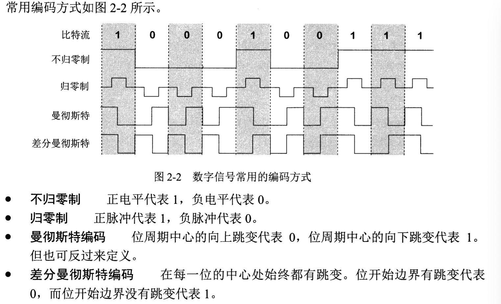
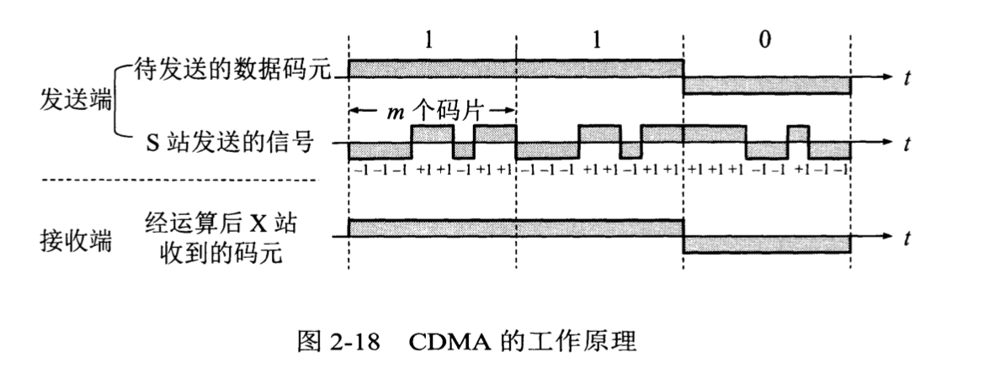
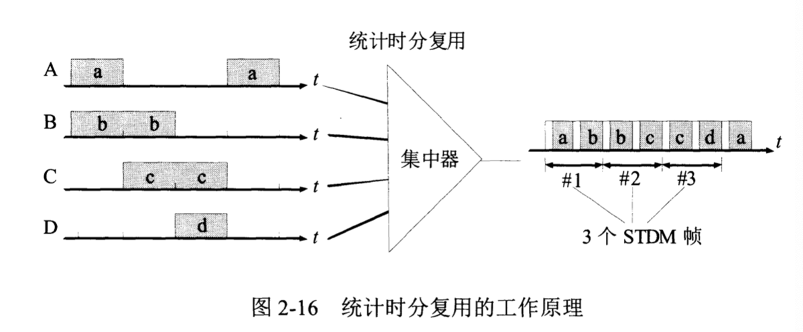

# 物理层

## 数据通信基础知识

* 通信系统的划分
  * 源系统（发送端）
    * 源点：产生数据，生成数字比特流
    * 发送器：将生成的比特流通过发送器编码，调制器
  * 传输系统（传输网络）
  * 目的系统（接收端）
    * 接收器：接受传输系统传过来的信号，还原发送端产生的数字比特流，解调器
    * 终点：从接收器获取数字比特流

* 信号的分类
  * 模拟信号：又称连续信号
  * 数字信号：又称离散信号
* 信道
  * 概念：表示某一个方向传送信息的媒体
  * 交互方式**（横向，同步）**
    * 单工通信（单向）：只有一个方向传输
    * 半双工通信（双向交替）：双方均可发送消息，但不可同时发送，只可交替
    * 全双工通信（双向同时）：双方可同时发送/接收消息
* 常见编码方式**（横向，语法）**
  * 不归零制、归零制、曼彻斯特编码、差分曼彻斯特编码
  * 

* 信道的极限容量
  * 限制码元在信道上传输速率的因素
    * 信道能够通过的评率频率范围：奈氏准则
    * 信噪比
      * 信号和噪声的平均功率之比
      * 香农公式

## 信道复用技术  （横向 语义）

复用器：让大家合起来用一个共享信道进行通信，再在接收端使用分用器

* 频分复用
  * 分配一段频带给用户，用户自始至终都使用这个频带
  * 所有用户在同样时间占用不同的频率带宽范围

* 时分复用
  * 将时间划分为一段段等长的时分复用帧
  * 统计时分复用
    * 集中器连接4个低速用户，将他们数据集中起来通过高速电路发送到远地计算机

* 波分复用

* 码分复用（码分多址CDMA）
  * 每一个bit时间划分为m个间隔，称为码片
  * 使用CDMA的每个站被指派唯一一个m bit的码片序列
    * 比如码片序列为0001-1011
    * 当站发送比特1，发送序列0001-1011
    * 发送比特0，发送序列1110-0100
  * 每个站分配的码片序列均不同，且互相正交（码片序列规格化内积为0）
  * 工作原理
    * A为发送站，B为接收站
    * A先向B站发送A特有的码片序列CodeA
    * B站接收
      * B站接收到的序列是各个站发送的码片序列之和
      * 将未知信号与CodeA做规格化内积
        * 如果结果为+1，则表明A发送比特1，结果为-1表明A发送比特0
        * 与CodeA内积可以过滤掉其他站的信号，因为CodeA与其他站的码片序列正交，依据叠加原理，结果为0

