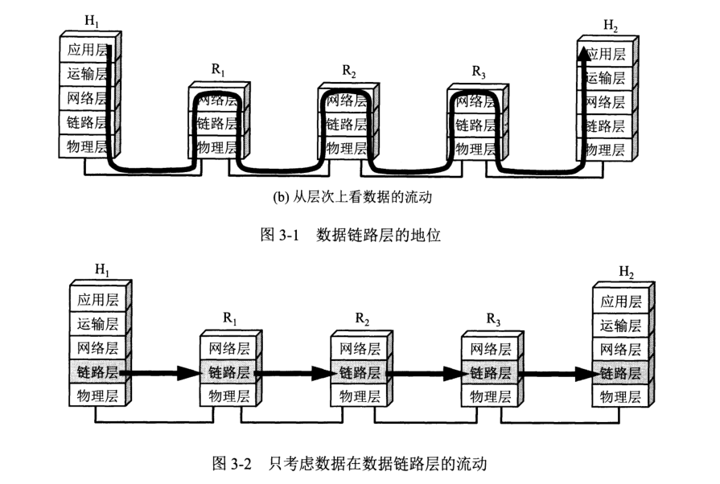
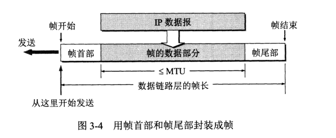
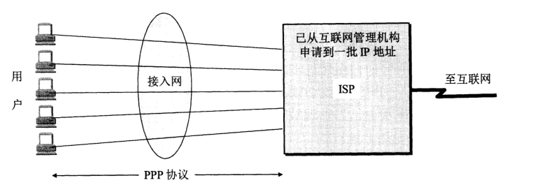
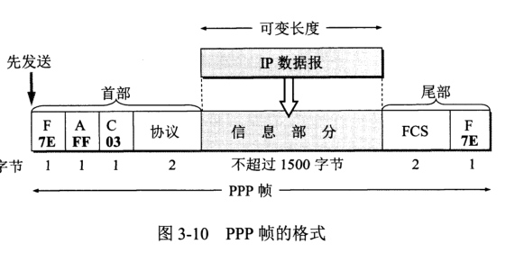
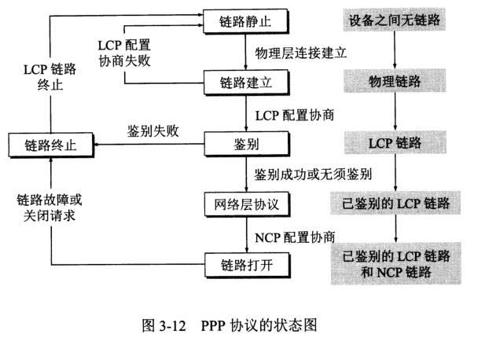
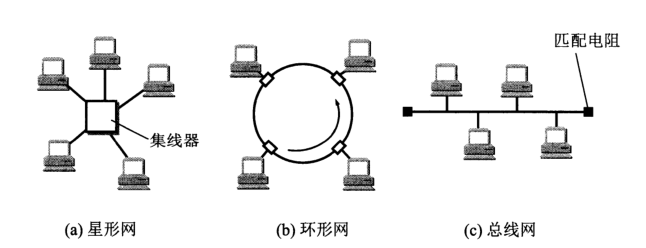
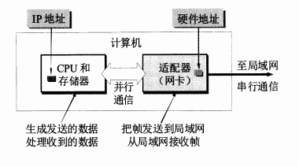
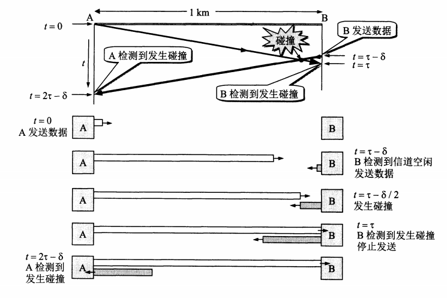

# 数据链路层

## 概述

* 数据链路层的讨论范围

  * 分组怎么样从一台主机传送到另外一台主机，但是并不经过路由器转发

* 数据链路层信道类型
  * 点对点信道：1对1通信（PPP协议）
  * 广播信道：
    * 一对多的广播通信方式
    * 广播信道上主机很多，因此需要专门协议协调这些主机的数据发送：CSMA/CD协议

* 数据链路层基本问题
  * 封装成帧
  * 透明传输
  * 差错检测

* 在专门研究某一层的问题时候

  * 我们只关心协议栈中水平方向的各数据链路层

  * 想象数据就是水平传输的，屏蔽底层逻辑，如下图

    

## 数据链路层的基本问题

### 一些概念

* 链路：从一个节点到相邻节点的一段物理线路
* 数据链路：链路+实现通信协议的软件和硬件（比如网络适配器）
* 协议的基本数据单元：帧
  * 帧=网络层IP数据报+包装
  * 思考：为什么需要包装
    * 将校验加入包装，保障准确传输
    * 将一个个连续的数据报分割，一个个数据报传输，（加上首部和尾部）
* 数据链路层通信的主要步骤
  * A将上层IP数据报封装成帧
  * 把A封装好的帧传输给B的数据链路层
  * B校验有无查错，无查错从帧中提取IP数据报交给上层

### 三个基本问题

* 封装成帧——纵向的服务，帧=f(IP数据报)

  * 添加首部和尾部

    * 接受端接受到物理层上交的比特流后，可以识别帧开始和结束：定界符SOH(0x01)，EOH(0x04)，也可帮助识别不完整的帧
    * 首尾部包含控制信息

  * 所有在互联网传输的数据都以分组（IP数据报）为单位

  * 帧数据部分长度上限：最大传送单元MTU

    

* 透明传输——横向，语义，解释什么表示什么
  * 数据部分，字节填充
    * SOH/EOH/ESC=ESC + SOH/EOH/ESC

* 差错检测——横向，用来保障准确
  * 查错分类
    * 比特查错：0变1，1变0，无比特查错称为无差错传输，但是不是可靠传输
    * 非比特查错：帧丢失，帧乱序，帧重复
    * 二者刻画的维度、单位、对象不同
  * 保障无比特查错
    * CRC校验（循环冗余校验）
    * 先把数据划分成组，。。。待补充
  * 保障可靠传输
    * 通信质量好的链路：由上层协议（如运输层TCP）完成
    * 对于质量差的无线传输链路：数据链路层协议使用确认和重传机制，提供可靠传输

## PPP协议

* ISP（Internet Service Provider）
  * 互联网服务提供者
  * ISP可以从互联网管理机构申请到很多IP地址
  * 依据服务覆盖面积大小和拥有IP地址数目不同，ISP也分为不同层次

  

* PPP协议（Point-to-Point Protocol）

   * 应用范围：用户计算机和ISP通信时使用的数据链路层协议
       

   * 设计需求
       * 简单、封装成帧、透明传输
       * 支持多个网络层协议（NCP）以及多种类型链路（LCP）
       * 差错检测、检测连接状态、设置MTU（最大传送单元）
       * 网络层地址协商、数据压缩协商

   * 组成部分
       * 一种将IP数据报封装到串行链路的方法（PPP帧）
       * 链路控制协议 LCP（Link Control Protocol）：用来建立、配置和测试数据
       * 一套网络控制协议NCP（Network Control Protocol）：其中每个支持不同的网络层协议

       

   * 帧格式**（语义，每个字段有其含义，为上层提供保障，且保证本层的可靠传输）**

       

       * 首部和尾部（体现封装成帧）
           * 首部4个字段，尾部2个字段
           * 标志字段规定为0x7E，表示一个帧的开始和结束，连续出现两个0x7E表示帧为空
           * 首部=0x7E+0xFF（无意义）+0x03（无意义）+协议字段（用于说明信息字段的含义）
           * 协议字段：0x0021，PPP帧信息字段为IP数据报；0xC021，LCP数据；
           * 尾部=FCS（Frame Check Sequence帧检验序列，使用CRC校验）+ 标志字段0x7E
       * 字节填充（体现透明传输）
           * 异步传输：数据逐个字符发送；
           * 同步传输：数据以一连串的比特流连续传送
           * 当PPP协议使用异步传输
           * 转义字符：0x7D，使用字节填充
           * 标志字符0x7E、转义字符0x7D、ASCII码控制字符，需要在前面加上0x7D
       * 零比特填充
           * 当PPP协议使用同步传输，如使用SONET/SDH链路
           * 信息字段
               * 五个连续的1，则填充一个0
               * 原因：标志字段F=0x7E，为0111 1110，一共6个连续的1
               * 接收端：找到标志字段后，把五个连续的1后面的一个0删除
       * 各种填充的实质：达到透明传输，对信息字段中的特殊字符进行处理，避免传输的时候和标志位等冲突，造成传输失败

       

   * PPP协议工作状态

       * 建立连接
           * 用户拨号接入ISP，建立用户个人电脑到ISP的物理连接。
           * 用户个人电脑向ISP发送一系列LCP分组，以便建立LCP链接
           *  进行网络层配置，NCP给新接入用户电脑分配临时IP地址
       * 释放链接（与建立链接顺序相反）
           * 通信完毕时，NCP释放网络层链接，收回分配的IP地址
           * LCP释放数据链路层链接
           * 最后释放物理层链接
    

## 局域网

* 广播信道

  * 广播信道可进行一对多通信，局域网使用的就是广播信道

* 局域网和广域网

  * 局域网，LAN（Local Area Network），指在某一区域内由多台计算机互联成的计算机组，现在以太网几乎成了局域网的同义词。

  * 广域网，WAN（Wide Area Network），又称外网、公网。指的是连接不同地区局域网或城域网计算机通信的远程网，通常跨接很大的物理范围。

  * 局域网按拓扑分类
    

  * 局域网工作层次跨越物理层和数据链路层

  * 共享信道如何让用户合理方便的共享媒体资源

    * 静态划分信道：（频/时/波/码分复用），划分代价高
    * 多点接入：并非在用户通信时固定分配给用户
      * 随机接入：需要解决碰撞的协议
      * 受控接入：用户不能随机发送消息，必须受到控制，如令牌环局域网和多点线路轮询

  * 以太网

    * IEEE802将局域网的数据链路层拆分为

      * LLC（Logical Link Control逻辑链路控制）层：LLC与传输媒体无关
      * MAC（Medium Access Control媒体接入控制）层：与接入到媒体有关的内容均放在MAC层
      * MAC层对LLC层是透明的
      * 现在很多厂商适配器仅装有MAC层协议而没有LLC层协议

    * 适配器

      * 本来是主机箱内插入的一块接口板，称为网络接口卡/网卡（Network Interface Card）

      * 现在主板上已经嵌入这种适配器，不再单独使用网卡

      * 作用

        * 收到有查错帧时候，丢弃不通知计算机；收到正确帧，中断通知计算机，并交付协议栈网络层
        * 计算机发送IP数据报时候，由协议栈将数据报下放至适配器，组装成帧发送到局域网
        * 硬件地址MAC地址存放在适配器ROM中，IP地址存在计算机存储器中
  
        

## CSMA/CD协议

* 思路
  * 为了在总线上实现一对一通信
  * 给每台适配器分配不同地址，发送帧的时候写明接受站的地址
  * 数据帧中目的地之和适配器ROM中硬件地址一致的时候，接受该数据帧，否则丢弃
* 为了通信简便，以太网采取的措施
  * 无连接工作方式
    * 发送数据前不必先建立连接
    * 适配器对发送的数据不编号，不要求对方发回确认（因为局域网信道质量好，发生错误概率小）
    * 目标站收到错误帧是否要重传：由高层协议决定，如TCP发现数据丢失后会重传
    * 同一时间只能允许一台计算机发送数据，使用CSMA/CD协议解决碰撞问题
  * 使用曼彻斯特编码

* CSMA/CD协议要点
  * 全称
    * 载波监听多点接入/碰撞检测
    * Carrier Sense Multiple Access with Collision Detection
  * 多点接入：多个计算机接入在同一根总线上
  * 载波监听
    * 发送前和发送中检测信道
    * 发送前：为了获得发送权
    * 发送中：及时发现有无冲突
  * 碰撞检测

    * 边发送边监听
    * 适配器边发送边检测电压，判断其他站是否也在发送数据
    * 最迟经过多长时间，才能知道自己发送的数据有无冲突

      * 电磁波在1km的传播时延约为5us

      * 记单程端到端传播时延为τ，可以看出最多2t的时间可以检测到冲突

      * 局域网取总线两端距离最大的两个站的传播时延，作为端到端的传播时延
        
    * CSMA/CD
      * 一个站不可能同时接收和发送，但必须边发送边监听信道
      * 使用CSMA/CD的以太网只能进行半双工通信
      * 发送的不确定性：不能保证自己的数据帧一定能传送出去
      * 最多经过2t时间即可知道是否发生碰撞
        * 争用期：往返时间2τ，又称碰撞窗口
        * 经过争用期还没检测到碰撞，则肯定此次不会发生碰撞
      * 碰撞后重传
        * 截断二进制指数退避，碰撞后推迟一段时间重传
        * 具体算法如下
          * 规定2t=51.2us，对于10Mbit/s的以太网，争用期可发送64字节（512比特时间）
          * $重传退后时间=r*2τ=rand(0,2^k-1)*2τ,\ k=min(重传次数,10)$
          * 重传超过16次，丢弃该帧，向上层报告
          * 

